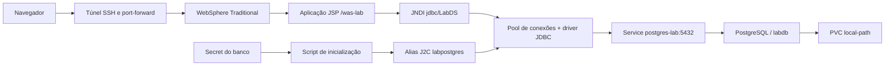

# WebSphere JDBC Lab com K3s e PostgreSQL

Laboratório prático de IBM WebSphere Application Server Traditional: deploy de uma aplicação JSP, configuração de JDBC/DataSource, autenticação J2C, persistência do PostgreSQL e diagnóstico de falhas em Kubernetes.

A aplicação consulta produtos usando `java:comp/env/jdbc/LabDS`. O WebSphere gerencia as conexões e obtém as credenciais de um alias configurado a partir de um Kubernetes Secret. O WAR não contém senha do banco.

## Resultado do laboratório

No ambiente de referência, a validação confirmou:

```text
LAB_AUTH_SECRET_MATCH=SIM
LAB_RUNTIME_AUTH_OK
LAB_JDBC_OK: aplicacao respondeu HTTP 200 e consultou os produtos no PostgreSQL.
```

O último resultado foi obtido após substituir o pod do WebSphere, sem redigitar a senha pelo console. Os três produtos permaneceram no volume do PostgreSQL.

**Status:** o fluxo foi validado no laboratório original. Esta organização do repositório acrescenta empacotamento do WAR a partir do código e instalação em namespace novo; essas adaptações possuem verificações estáticas, mas ainda precisam de uma execução completa em ambiente limpo.

## Arquitetura



O banco utiliza armazenamento persistente. O WebSphere é reconstruído a partir da imagem, dos scripts e dos Secrets; seu filesystem gravável não é usado como backup de configuração.

## Tecnologias e conceitos

| Componente | Uso |
|---|---|
| WebSphere Traditional 9.0.5.29 | Servidor Java EE e administração JDBC/J2C |
| IBM Java 8 | JVM fornecida pela imagem IBM |
| PostgreSQL 16 | Banco relacional do laboratório |
| pgJDBC 42.7.13 | Driver ConnectionPoolDataSource |
| K3s / containerd | Execução e gerenciamento dos contêineres |
| Podman | Construção da imagem de aplicação |
| wsadmin / Jython | Configuração automatizada do WebSphere |
| JSP / JDBC / JNDI | Consulta e apresentação dos dados |

## Pré-requisitos

- Linux x86_64 com K3s instalado e node `Ready`; validado originalmente em RHEL 8.10.
- CoreDNS e provisionador `local-path` funcionando.
- Podman, `curl`, `unzip`, `zip`, `openssl` e Bash.
- Planejar aproximadamente 10 GiB de RAM para a VM do laboratório e pelo menos 15 GiB **livres** durante a construção. São referências práticas, não mínimos oficiais de produto.
- Acesso aos registries IBM/Docker Hub e ao site do pgJDBC.
- Executar como root no servidor de laboratório; não aplicar em um cluster compartilhado sem adaptar permissões e nomes.

No RHEL, instale as ferramentas:

```bash
dnf install -y podman curl unzip zip openssl git
```

Antes de começar:

```bash
k3s kubectl get nodes
k3s kubectl get pods -n kube-system
k3s kubectl get storageclass local-path
```

O laboratório original precisou de cgroup v2 para sua versão do K3s. A instalação do K3s e a configuração da VM são pré-requisitos deste repositório.

## Instalação automatizada

Clone este repositório e, dentro da pasta dele, execute:

```bash
bash executar.sh
```

O script solicitará duas senhas diferentes, sem exibi-las:

1. Senha de `waslab`, usuário de consulta no PostgreSQL, se o Secret ainda não existir.
2. Senha de `wsadmin`, usuário do console, se o Secret ainda não existir.

Ele cria o banco com três produtos, gera o WAR a partir dos fontes, obtém o driver, constrói a imagem, importa no containerd, configura o Deployment e testa a consulta HTTP. A imagem IBM pode ser reutilizada do cache do K3s para evitar outro download.

**Em um laboratório existente**, o script mantém os Secrets e o PVC, mas substitui a especificação de execução do WebSphere. Alterações feitas apenas no console não são incorporadas automaticamente. Há indisponibilidade durante a atualização. O backup do Deployment não é um backup dos arquivos internos do antigo contêiner.

O script de inicialização verifica se a senha salva no alias é igual ao Secret e só então inicia o servidor. O ConfigMap contém código; senhas ficam em Secrets.

## Acesso

No servidor, mantenha aberto:

```bash
k3s kubectl port-forward -n websphere service/was 9043:9043 9443:9443 --address=127.0.0.1
```

Se o navegador estiver em outro computador, crie um túnel SSH. Substitua `USUARIO`, `HOST` e `PORTA_SSH` pelos valores do seu ambiente:

```bash
ssh -p PORTA_SSH -N -L 127.0.0.1:9043:127.0.0.1:9043 -L 127.0.0.1:9443:127.0.0.1:9443 USUARIO@HOST
```

- Console: https://127.0.0.1:9043/ibm/console — usuário `wsadmin`.
- Aplicação: https://127.0.0.1:9443/was-lab/
- Consulta: https://127.0.0.1:9443/was-lab/jdbc.jsp

O certificado inicial é autoassinado. O banco não é publicado externamente.

## Validação e recuperação

```bash
bash scripts/03-validar.sh
```

O teste usa a porta local alocada automaticamente, mas envia `Host: localhost:9443` para respeitar o virtual host do WebSphere. Ele exige HTTP 200 e um produto esperado na resposta.

Para verificar recuperação depois de um reinício, com breve indisponibilidade:

```bash
k3s kubectl rollout restart deployment/was -n websphere
k3s kubectl rollout status deployment/was -n websphere --timeout=1800s
bash scripts/03-validar.sh
```

Reabra o port-forward após recriar o pod. A imagem local precisa existir no node; este projeto não configura um registry distribuído nem alta disponibilidade.

## Estrutura

```text
app/src/main/webapp/   JSPs e descritores Java EE
database/             PostgreSQL, PVC e inicialização SQL
image/                Containerfile, wsadmin e inicialização validada
k8s/                  Deployment, Service e patch do WebSphere
scripts/              Construção, deploy e validação
docs/                 Diagnóstico, decisões e operação
tools/                Verificações estáticas do projeto
executar.sh           Fluxo completo do laboratório
```

Veja [os problemas investigados e as soluções](docs/TROUBLESHOOTING.md), [as decisões de arquitetura](docs/DECISOES.md) e [como operar e atualizar o projeto](docs/OPERACAO.md).

## Limites e cuidados

- Projeto didático; não é um modelo pronto para produção nem uma declaração de certificação WebSphere/PostgreSQL.
- `local-path` protege contra recriação do pod, não contra perda do disco/VM. Planeje backup do banco e do cluster.
- Secrets não substituem controles de acesso e criptografia em repouso. Não publique dumps de Secrets nem `security.xml`.
- O usuário `waslab` tem permissão de consulta na tabela do laboratório; a senha administrativa é separada.
- Driver, WAR e imagens são gerados/baixados localmente e ignorados pelo Git.
- Senhas e mudanças de configuração realizadas apenas pelo console não alteram os arquivos deste repositório.
- JVM dumps, limites de recursos, TLS entre aplicação e banco, monitoração e alta disponibilidade ficam como evolução do laboratório.

## Referências e licenças de terceiros

- [Imagem IBM WebSphere Traditional e configuração reproduzível](https://github.com/WASdev/ci.docker.websphere-traditional)
- [Driver PostgreSQL JDBC](https://jdbc.postgresql.org/download/)
- [DataSources e connection pools no pgJDBC](https://jdbc.postgresql.org/documentation/datasource/)
- [K3s](https://docs.k3s.io/)

IBM WebSphere, PostgreSQL e seus drivers têm licenças próprias. Este repositório não inclui seus binários nem concede direitos sobre eles. Verifique os termos da imagem IBM antes do uso, especialmente fora do laboratório. Uma licença para os arquivos autorais deste projeto deve ser escolhida pelo responsável pelo repositório.
